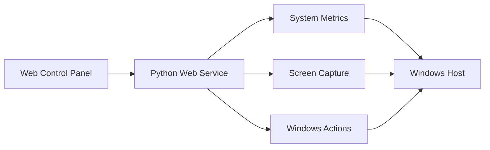
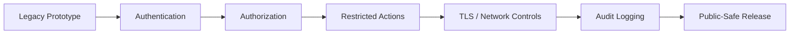

# DZ_Shutdown

<h3 align="center">Windows Remote Management Prototype</h3>

  A Python-based experimental control panel for Windows system monitoring and administrative actions.

  
  
  

---

## Overview

DZ_Shutdown is an older Windows remote-management prototype built around a Python web interface.

The original project combines system-status monitoring with remote administrative controls such as scheduled power actions, screen viewing, input-control experiments, and a browser-based console.

## Architecture

## Original Prototype Capabilities

- Windows system information and resource monitoring
- CPU, memory and network statistics
- Scheduled shutdown / restart / sleep / lock actions
- Live screen-preview experiments
- Browser-based control interface
- Command-console prototype
- Mouse and keyboard-control experiments
- Windows startup integration

## Security Status

The historical implementation was created as a local/controlled-environment prototype and is **not currently suitable for public deployment**.

Before publishing or deploying the original source, the following controls should be implemented:

- strong authentication
- authenticated sessions
- CSRF protection
- explicit authorization for administrative actions
- restricted network binding
- command allow-listing or removal of arbitrary command execution
- TLS when used across a network
- rate limiting
- security logging and audit trails
- secure startup/install behavior

Because the historical source exposes privileged remote-control functionality without an adequate authentication boundary, it is intentionally not published in this public repository in its current form.

## Intended Use

This repository is intended to document and eventually harden the project for authorized administration of systems you own or have explicit permission to manage.

## Technology

The historical prototype uses Python and components in the Flask / Socket.IO ecosystem together with Windows system and screen/input libraries.

## Roadmap

## Author

**Danial Zolfaghari**

GitHub: [@Danial-Zolfaghari](https://github.com/Danial-Zolfaghari)
