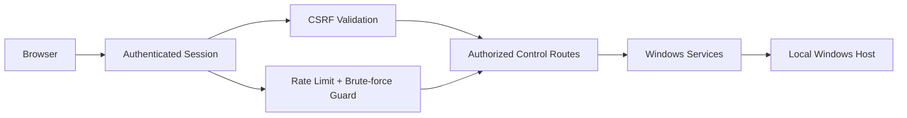
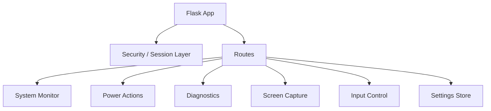

# DZ_Shutdown

<p align="center"><strong>Secure local-first Windows administration dashboard</strong></p>

<p align="center">
  
  
  
</p>

## Overview
DZ_Shutdown is a Windows-focused Flask dashboard for authenticated local/controlled-network administration: system telemetry, power actions, diagnostics, optional screen/input tooling, and configurable security controls.

## Supported platforms
| Platform | Support | Notes |
|---|---:|---|
| Windows 10/11 | ✅ | Primary and supported target |
| Linux | ❌ | Windows power/input APIs are required |
| macOS | ❌ | Windows-specific behavior is required |

## Security model


Security-oriented defaults include:
- loopback bind (`127.0.0.1`) by default
- a cryptographically random first-run password when no password hash is supplied
- hashed administrator password storage
- per-session CSRF tokens
- login rate limiting and progressive lockout
- optional shell/command functionality disabled by default
- configurable secure-cookie mode
- bounded command execution timeout

## Requirements
- Windows 10/11
- Python 3.11+

Install:
```powershell
python -m pip install -r requirements.txt
```

Main packages: Flask, psutil, MSS, OpenCV, NumPy and PyAutoGUI.

## First run
On first launch, when no `DZ_ADMIN_PASSWORD_HASH` is configured, the application generates a strong one-time administrator password, stores only its hash, and prints the password once in the local console. Change it immediately after login.

To supply your own password hash:
```powershell
python make_password.py
```

Then store the generated hash in a local `.env` file as `DZ_ADMIN_PASSWORD_HASH`.

## Run
```powershell
python run.py
```
or:
```bat
start.bat
```

Default listener: `127.0.0.1:5000`.

## Architecture


## Project layout
```text
DZ_Shutdown/
├─ app/
│  ├─ routes.py
│  ├─ security.py
│  └─ services/
├─ static/
├─ templates/
├─ data/
├─ config.py
├─ run.py
├─ make_password.py
└─ requirements.txt
```

## Deployment notes
This is an administrative tool. Keep it on localhost or a trusted management network, use a strong password, enable secure cookies behind HTTPS, and place a hardened reverse proxy in front of it if remote access is required.

## Author
**Danial Zolfaghari** — [@Danial-Zolfaghari](https://github.com/Danial-Zolfaghari)
