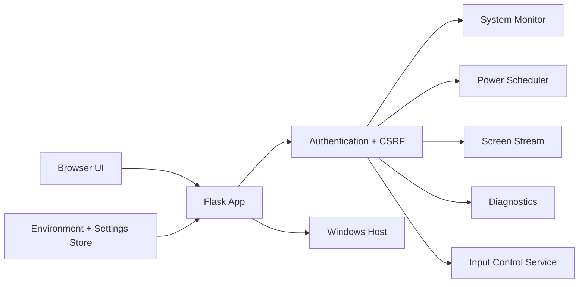
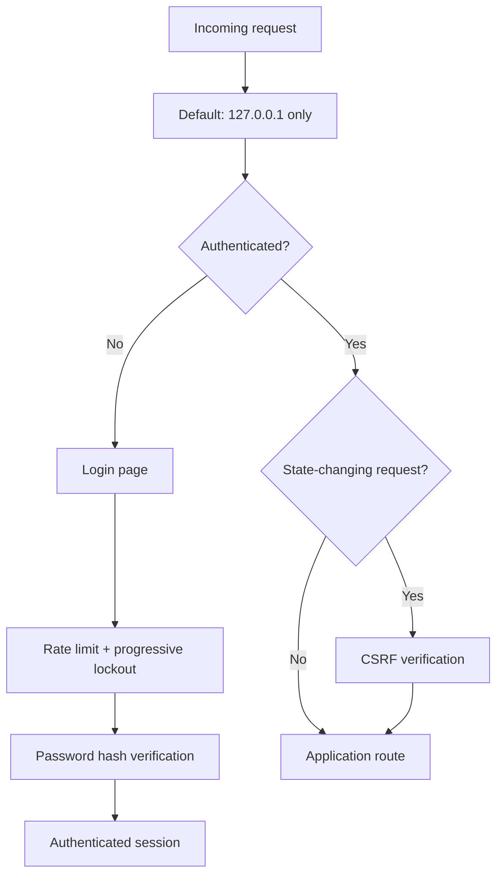

# DZ_Shutdown

<p align="center">
  <strong>Secure local-first Windows control & diagnostics dashboard</strong><br/>
  System monitoring, scheduled power actions, screen preview, diagnostics, security controls, and optional administrative tooling from a browser UI.
</p>

<p align="center">
  
  
  
  
</p>
<p align="center">
  <a href="https://github.com/Danial-Zolfaghari/DZ_Shutdown/actions/workflows/ci.yml"></a>
  <a href="https://github.com/Danial-Zolfaghari/DZ_Shutdown/releases"></a>
  <a href="LICENSE"></a>
</p>


---

## Overview

**DZ_Shutdown** is a Windows administration dashboard designed around a **local-first security model**. It exposes system information and controlled administrative actions through a modern Flask web interface while keeping sensitive capabilities behind authentication, CSRF protection, brute-force protection, and explicit configuration switches.

The current public version is a hardened rewrite of the earlier single-file prototype.

## Architecture



## Features

### Dashboard
- CPU usage
- Memory usage
- Network statistics
- System / host information
- Responsive browser UI

### Power scheduling
- Shutdown
- Restart
- Sleep
- Lock
- Countdown scheduling
- Scheduled-time actions
- Task cancellation

### Screen & control
- Authenticated live screen stream
- Input-control service integration
- Dedicated screen page

### Diagnostics
- Built-in helper commands
- Command timeout handling
- Optional custom shell execution
- Custom shell is **disabled by default**

### Security
- Password-hash based administrator authentication
- HTTP-only session cookies
- Strict SameSite cookie policy
- Optional `Secure` cookie flag
- CSRF validation
- Login request throttling
- Progressive brute-force lockout
- Constant-time username comparison
- CSP / anti-framing / no-sniff security headers
- Safe redirect handling
- Localhost-only bind by default
- Runtime secret key generation when not configured

## Security model



> **Important:** The project contains administrative functionality. Keep it bound to localhost unless you deliberately deploy it behind a trusted authenticated TLS reverse proxy and understand the security implications.

## Platform support

| Platform | Support | Notes |
|---|---|---|
| Windows 10/11 | ✅ Full | Power, input control, screen capture and diagnostics |
| Linux | ❌ Not supported | Windows-specific administrative actions |
| macOS | ❌ Not supported | Windows-specific administrative actions |

## Requirements

- Windows 10 / 11 recommended
- Python **3.10+**
- Administrator rights may be required for some power/input operations

Installable Python dependencies:

```text
Flask>=3.1,<4
psutil>=6.1,<8
mss>=10,<11
opencv-python>=4.10,<5
numpy>=2.1,<3
PyAutoGUI>=0.9.54,<1
```

## Installation

```powershell
git clone https://github.com/Danial-Zolfaghari/DZ_Shutdown.git
cd DZ_Shutdown
python -m venv .venv
.\.venv\Scripts\Activate.ps1
pip install -r requirements.txt
```

Copy the environment template:

```powershell
Copy-Item .env.example .env
```

## First-run administrator password

You do **not** need to generate a password hash manually before the first start.

Run the application normally:

```powershell
python run.py
```

Before Flask starts, DZ_Shutdown checks whether an administrator password already exists.

If no password hash exists in `data/settings.json` and no `DZ_ADMIN_PASSWORD_HASH` is configured, DZ_Shutdown:

1. generates a strong random administrator password;
2. stores **only its Werkzeug hash** in `data/settings.json`;
3. prints the plaintext password to the console **once**;
4. starts the web application normally.

Example first-run output:

```text
====================================================================
 DZ_Shutdown - FIRST RUN ADMIN CREDENTIALS
====================================================================
 Username : admin
 Password : <generated-password>
--------------------------------------------------------------------
 Save this password now. The plaintext password is NOT stored
 and will NOT be printed again after this first bootstrap.
====================================================================
```

On later starts the saved password hash is reused, so a new password is not generated or printed.

### Optional manual configuration

Advanced users can still provide a password hash through `.env`:

```dotenv
DZ_ADMIN_USERNAME=admin
DZ_ADMIN_PASSWORD_HASH=your-generated-hash
```

To create a hash manually:

```powershell
python make_password.py
```

You may also set `DZ_INITIAL_ADMIN_PASSWORD` before the **first** run if you want to choose the bootstrap plaintext password yourself.

Also replace the Flask secret for persistent deployments:

```dotenv
DZ_SECRET_KEY=replace-with-a-long-random-secret
```

## Run

PowerShell:

```powershell
.\start.ps1
```

Command Prompt:

```bat
start.bat
```

Or directly:

```powershell
python run.py
```

Default URL:

```text
http://127.0.0.1:5000
```

## Environment configuration

| Variable | Default | Purpose |
|---|---:|---|
| `DZ_HOST` | `127.0.0.1` | Bind address |
| `DZ_PORT` | `5000` | HTTP port |
| `DZ_SECRET_KEY` | generated | Flask session signing key |
| `DZ_ADMIN_USERNAME` | `admin` | Administrator username |
| `DZ_ADMIN_PASSWORD_HASH` | empty | Recommended explicit administrator password hash |
| `DZ_COOKIE_SECURE` | `0` | Require HTTPS-only cookies when `1` |
| `DZ_SCREEN_FPS` | `8` | Screen streaming FPS |
| `DZ_SCREEN_SCALE` | `0.65` | Screen scale factor |
| `DZ_COMMAND_TIMEOUT` | `12` | Diagnostic command timeout |
| `DZ_SESSION_MINUTES` | `120` | Session lifetime |
| `DZ_LOGIN_REQUEST_LIMIT` | `30` | Login request limit |
| `DZ_LOGIN_REQUEST_WINDOW` | `300` | Request-limit window |
| `DZ_LOGIN_MAX_FAILURES` | `5` | Failures before lockout |
| `DZ_LOGIN_FAILURE_WINDOW` | `600` | Failure tracking window |
| `DZ_LOGIN_BASE_LOCK` | `30` | Initial lockout seconds |
| `DZ_LOGIN_MAX_LOCK` | `900` | Maximum lockout seconds |

## Custom shell behavior

Arbitrary custom shell execution is intentionally **off by default**.

The Settings page can persist the shell option, but applying the change requires an application restart. Keep it disabled unless the deployment is trusted and the capability is explicitly needed.

## Project structure

```text
DZ_Shutdown/
├─ app/
│  ├─ services/
│  │  ├─ diagnostics.py
│  │  ├─ input_control.py
│  │  ├─ power.py
│  │  ├─ screen.py
│  │  ├─ settings_store.py
│  │  └─ system_monitor.py
│  ├─ routes.py
│  └─ security.py
├─ static/
│  ├─ css/
│  └─ js/
├─ templates/
├─ data/
├─ .env.example
├─ config.py
├─ make_password.py
├─ requirements.txt
├─ run.py
├─ start.bat
└─ start.ps1
```

## Deployment guidance

For anything beyond local machine access:

1. Do not bind directly to an untrusted interface without additional protection.
2. Put the app behind a trusted TLS reverse proxy.
3. Use a strong, unique administrator password.
4. Set a persistent high-entropy `DZ_SECRET_KEY`.
5. Set `DZ_COOKIE_SECURE=1` when serving over HTTPS.
6. Keep custom shell execution disabled unless absolutely required.
7. Restrict access using host firewall rules or a private VPN/network.

## Responsible use

Use DZ_Shutdown only on Windows systems you own or are explicitly authorized to administer.

## Author

**Danial Zolfaghari**  
GitHub: [@Danial-Zolfaghari](https://github.com/Danial-Zolfaghari)

---

## Author

**Danial Zolfaghari** — [@Danial-Zolfaghari](https://github.com/Danial-Zolfaghari)

